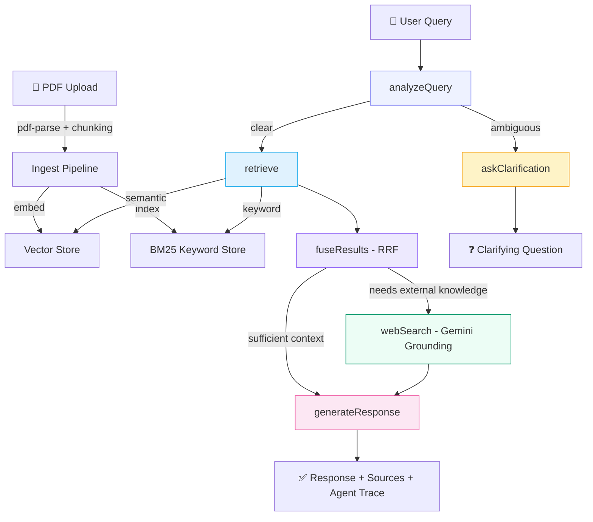

# Alex — Agentic RAG PDF Chat Assistant

> Upload PDF documents and chat with **Alex**, an AI assistant powered by a **LangGraph agentic pipeline** that answers questions using hybrid retrieval, web search grounding, domain-aware analysis, and intelligent clarification.

## Problem → Solution → Impact

| | |
|---|---|
| **Problem** | Extracting specific answers from dense PDFs (medical prescriptions, contracts, research papers) is slow and error-prone. Keyword search misses context; simple LLMs hallucinate without grounding. |
| **Solution** | Alex combines a **6-node LangGraph agent** with **hybrid retrieval** (semantic vectors + BM25 keywords), **Reciprocal Rank Fusion**, **Google Search grounding**, and **domain-aware prompting** (medical auto-detection) to deliver precise, cited answers. |
| **Impact** | Users get grounded, source-cited answers in seconds — with full transparency into the agent's decision process via an interactive trace UI. Medical documents get specialized analysis with drug interaction awareness and safety disclaimers. |

## Architecture



### Agent Nodes

| Node | Purpose |
|---|---|
| `analyzeQuery` | LLM-powered intent classification — detects ambiguous queries and external knowledge needs |
| `askClarification` | Generates targeted clarifying questions when query is vague |
| `retrieve` | Parallel hybrid retrieval — semantic vector search + BM25 keyword search |
| `fuseResults` | Reciprocal Rank Fusion (RRF) merges and re-ranks results from both retrievers |
| `webSearch` | Google Search grounding via Gemini — fetches external knowledge when documents alone are insufficient |
| `generateResponse` | Grounded response generation with source citations, page numbers, and domain-aware analysis |

## Key Features

### Agentic Intelligence
- **6-node LangGraph state graph** with conditional routing — not a fixed pipeline
- **Clarifying questions** when queries are ambiguous (agent decides, not rules)
- **Agent decision trace** visible in the UI — see exactly which nodes fired and why

### Hybrid Retrieval
- **Semantic vector search** via Gemini embeddings (3072 dimensions)
- **BM25 keyword search** with inverted index (k1=1.5, b=0.75)
- **Reciprocal Rank Fusion** for optimal result merging — match-type badges (Semantic / Keyword / Both)

### Source Attribution
- **Page-level citations** — each source shows filename, chunk index, and estimated page number
- **Snippet preview** with match-type badges for transparency
- **Collapsible source panel** so answers stay clean

### Web Search Grounding
- **Google Search via Gemini** when documents lack context (e.g., "what condition is this prescription for?")
- Agent autonomously decides when external knowledge is needed
- Clear UI indicator: "Enhanced with web search"

### Medical Domain Intelligence
- **Auto-detection** of medical content (prescriptions, dosages, drug names)
- Specialized prompting: drug class identification, interaction warnings, dosage validation
- Always includes medical disclaimer for safety

### Production Quality
- Multi-model fallback chain (Gemini 2.5 Flash Lite → 2.0 Flash → 2.5 Flash) for rate limit resilience
- Structured JSON logging with trace IDs for observability
- Request timeouts and graceful error handling
- Session-scoped storage for multi-user isolation

## Tech Stack

| Layer | Technology |
|---|---|
| **Agent Orchestration** | LangGraph (`@langchain/langgraph`) — state graph with Annotation-based state |
| **LLM** | Google Gemini — `gemini-2.5-flash-lite` (chat), `gemini-embedding-001` (embeddings), Google Search grounding |
| **Backend** | Node.js, Express, ESM modules, multer, pdf-parse |
| **Frontend** | React 18, Vite 6, Tailwind CSS v4, lucide-react, react-markdown |
| **Retrieval** | In-memory vector store (cosine similarity) + BM25 keyword index + RRF fusion |

## Project Structure

```
backend/
  services/
    agent.js          # LangGraph state graph — 6 nodes, conditional routing
    gemini.js         # Gemini SDK wrapper — multi-model fallback, web search
    vectorStore.js    # In-memory vector store with cosine similarity
    keywordStore.js   # BM25 keyword search engine
  routes/
    ingest.js         # PDF upload → extract → chunk → embed → index
    chat.js           # Chat endpoint → LangGraph agent invocation
  utils/
    chunker.js        # Sentence-aware text chunking with page estimation
    logger.js         # Structured JSON logging with trace IDs
frontend/
  src/
    components/
      ChatPanel.jsx   # Chat UI — messages, sources, agent trace, typing indicator
      PdfUpload.jsx   # Drag-and-drop upload with document chips
    hooks/
      useSession.js   # Session state — uploads, messages, agent trace data
    App.jsx           # Main layout with Alex branding
```

## Setup

1. Get a free [Google AI Studio API key](https://aistudio.google.com/apikey).

2. Create `backend/.env`:

```env
GEMINI_API_KEY=your_gemini_api_key_here
PORT=4000
```

3. Install dependencies:

```bash
cd backend && npm install
cd ../frontend && npm install
```

4. Start both servers:

```bash
# Terminal 1 — Backend
cd backend && npm run dev

# Terminal 2 — Frontend
cd frontend && npm run dev
```

5. Open **http://localhost:5173** → upload a PDF → ask Alex anything.

## Demo Flow

1. **Upload** a medical prescription PDF (drag-and-drop or click)
2. **Ask**: "What conditions is this prescription treating?"
3. **Alex** retrieves relevant chunks (hybrid search), detects medical content, optionally searches the web, and responds with:
   - Grounded answer with `[Source N]` citations and page numbers
   - Drug explanations (class, usage, interactions)
   - Medical disclaimer
4. **Inspect**: Click "Agent Trace" to see the full decision path — which nodes fired, retrieval counts, fusion results
5. **Follow up**: "Are there any drug interactions?" — Alex uses conversation history for context continuity
